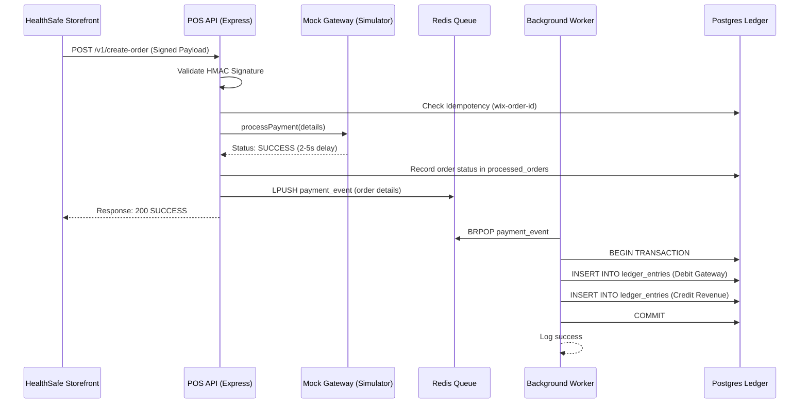

# System Architecture Document (SAD)

## 1. Overview
The Health Insurance POS (Payment Orchestration Service) is designed as a middleware between a **Wix Storefront** and a **Financial Ledger**. The primary architectural goal is **money-safety**, ensuring that every successful transaction is recorded using immutable, double-entry bookkeeping.

## 2. High-Level Data Flow
The system uses an asynchronous approach to decouple the real-time payment handshake from the financial accounting process.

### 2.1 Sequence Diagram

## 3. Key Components

### 3.1 Wix SPI Adapter (API Layer)
- Handles the entry point for Wix.
- Enforces **Idempotency** via a unique constraint on `wix-order-id`.
- Validates requests using HMAC-SHA256 signatures.

### 3.2 Gateway Simulator
- Mock service that mimics 3rd-party provider behavior.
- Injects artificial latency (2-5s) and random failure (10%) to test system resilience.

### 3.3 Asynchronous Layer (Redis)
- Decouples the frontend response from the ledger updates. 
- Even if the worker or database experiences transient issues, the `payment_event` remains safe in the Redis queue for later processing.

### 3.4 The Double-Entry Ledger (Postgres)
- **Immutability:** Records are only appended (`INSERT`), never `UPDATE`d or `DELETE`d.
- **Double-Entry:** Each transaction creates at least two offsetting entries (Debit/Credit) that sum to zero, ensuring financial integrity.
- **Precision:** Uses `DECIMAL(19, 4)` for all currency fields.

## 4. Resilience & Error Handling
- **Gateway Timeouts:** The API handles the simulator's latency and returns the appropriate status to the UI.
- **Duplicate Orders:** The idempotency layer prevents double-charging or duplicate ledger entries if the same Wix order is re-submitted.
- **Worker Crashes:** If the ledger worker fails, the message remains in the Redis list (BRPOP) or can be recovered from the queue.
